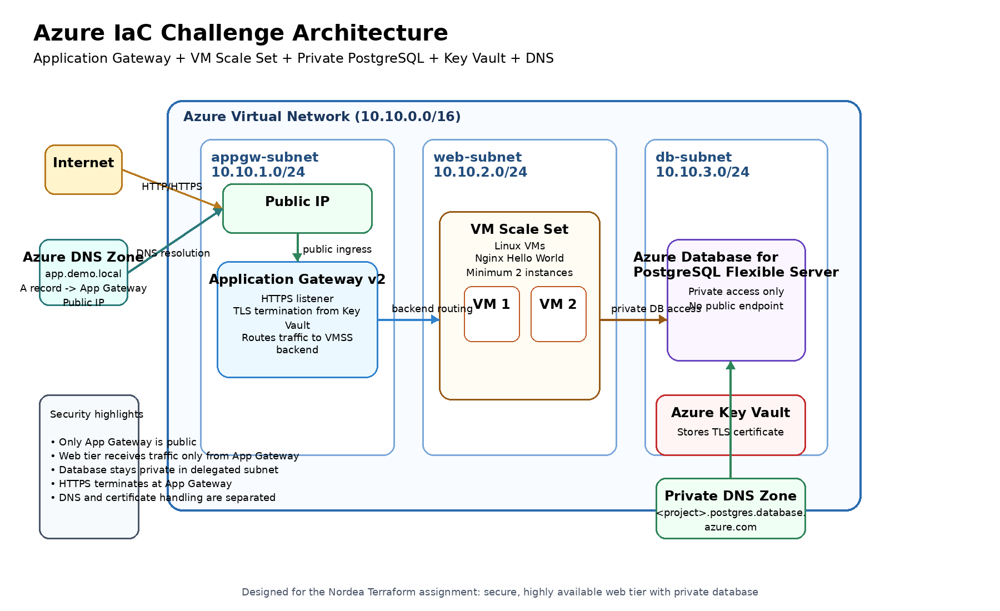

# Azure Infrastructure as Code Challenge

## Overview
This repository contains a Terraform-based Azure deployment for a simple highly available web application platform.

The solution provisions:
- An Azure Resource Group
- A Virtual Network with separate subnets for Application Gateway, web tier, and database tier
- An Azure Application Gateway v2 for HTTPS termination and traffic distribution
- An Azure Virtual Machine Scale Set running Nginx
- An Azure Database for PostgreSQL Flexible Server with private access
- Azure Key Vault for certificate management
- Azure DNS zone and application DNS record

The application itself is intentionally simple. The focus of this solution is on infrastructure design, security, network layout, and Terraform structure.

---

## Architecture Summary
The design uses a layered architecture:

- **Ingress Layer**: Azure Application Gateway v2 exposes the application over HTTPS
- **Compute Layer**: Azure VM Scale Set runs Nginx on Linux VMs
- **Data Layer**: Azure PostgreSQL Flexible Server runs privately inside the VNet
- **Security**: Only the Application Gateway is internet-facing. The database is not publicly accessible.
- **DNS**: A public DNS zone and A record are provisioned for the application hostname
- **TLS**: TLS is terminated at the Application Gateway using a certificate stored in Azure Key Vault

---

## Design Choices
### Why Application Gateway?
Application Gateway was chosen because the requirement is clearly web-focused and includes HTTPS termination, certificate handling, and traffic distribution.

### Why VM Scale Set?
The assignment requires virtual machines for the compute tier. VM Scale Set provides a better high-availability VM-based compute design than standalone VMs.

### Why PostgreSQL Flexible Server?
A managed database was chosen to reduce operational overhead and keep the focus on infrastructure quality, private networking, and security.

### Why Key Vault?
Key Vault keeps certificate handling separate from the gateway configuration and reflects a more production-oriented pattern.

### Why this network layout?
The network is split into dedicated subnets for edge, compute, and data tiers to keep traffic flow controlled and reduce exposure.

---

## Repository Structure

```text
.
├── README.md
├── providers.tf
├── versions.tf
├── variables.tf
├── main.tf
├── outputs.tf
├── terraform.tfvars.example
├── scripts/
│   └── cloud-init-nginx.sh
├── diagrams/
│   └── architecture.png
└── modules/
    ├── resource_group/
    ├── network/
    ├── key_vault/
    ├── compute/
    ├── application_gateway/
    ├── database/
    └── dns/

    
---

# 2) Architecture diagram description

You can turn this into a simple PowerPoint, draw.io, Excalidraw, or even a clean text diagram.

## Simple diagram content

```text
                    Internet
                        |
                        v
              +----------------------+
              |  Public DNS Zone     |
              |  app.demo.local      |
              +----------------------+
                        |
                        v
              +----------------------+
              | Application Gateway  |
              |      Standard_v2     |
              |   HTTPS Termination  |
              +----------------------+
                        |
                        v
              +----------------------+
              |   VM Scale Set       |
              |   Linux + Nginx      |
              |   web-subnet         |
              +----------------------+
                        |
                        v
              +----------------------+
              | PostgreSQL Flexible  |
              | Server (Private)     |
              | db-subnet            |
              +----------------------+

Supporting Services:
- Key Vault -> TLS certificate for Application Gateway
- Public DNS Zone -> app record to Application Gateway public IP
- Private DNS Zone -> PostgreSQL private name resolution
- VNet -> appgw-subnet, web-subnet, db-subnet

## Architecture Diagram



*Figure: Secure multi-tier architecture with Application Gateway, VM Scale Set, and private PostgreSQL.*